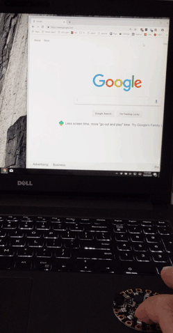

# Key and Mouse Playback

This library was designed for use with Teensy 3/LC but now works with Arduino
and Arduino compatible boards. An example is included for the Adafruit Circuit
Playground Express M0.

Play USB keyboard and USB mouse output from an ASCII string. This can be used
launch applications using a button press or cap touch.

Example: The following string launches the Chrome browser to Google using
Windows.

"GUI-KEY_R ~100 'chrome' SPACE 'https://www.google.com/' ENTER"

GUI-KEY_R -- The GUI key refers to the Windows logo key. KEY_R is the 'R' key
so GUI-KEY_R is equivalent to pressing and holding the GUI key, pressing and
releasing the 'R' key, then releasing the GUI key. On Windows, this opens a
one line command window.

~100 -- This means delay for 100 * 10 milliseconds = 1 second. This allows time
for the command window to open.

'chrome' -- This enters 'chrome' into the command line window.

SPACE -- This appends a SPACE character to the command.

'https://www.google.com/' -- This appends the Google URL into the command line.

ENTER -- This is equivalent to pressing the keyboard Enter key.

For Linux, change GUI-KEY_R to ALT-F2.

The key and mouse names are listed in keynames.h.

Examples
* "CTRL-MOUSE_LEFT" -- Control left mouse click.
* "+CTRL MOUSE_LEFT -CTRL" -- Same as above but requires more typing.
* "+CTRL ~1 MOUSE_LEFT ~1 -CTRL" -- Add 10 ms delay around left mouse click.
  The '+' prefix means press and hold the key down. The '-' prefix means
  release the key.

WARNING: Strings with embedded spaces are not currently supported. For example,
the string 'chrome https://www.google.com/' does not work because it has an
embedded space between 'chrome' and the URL. See the above example for how to
handle this.

## Examples

### CircuitPlayground

Demonstrate key macros triggered by CPX buttons and captouch. Turns a CPX into
an application launcher. As long as the application can be launched from
command line, there is no need to install software on the computer.

* Pressing the left button opens Chrome to Google.
* Pressing the right button opens Chrome to Youtube.
* Touching captouch #3 (A4) opens Chrome to Adafruit.

The only problem is the sketch must be recompiled and uploaded to change
the keyboard macros. See the
[XYmodem](https://github.com/gdsports/XYmodem/tree/master/examples/CircuitPlaygroundExpress)
project for a version where the key macros can be uploaded using the YMODEM
file transfer protocol. This allows users to change the macros without
installing and using the Arduino IDE. The only program required is a terminal
program such as TeraTerm or minicom.
